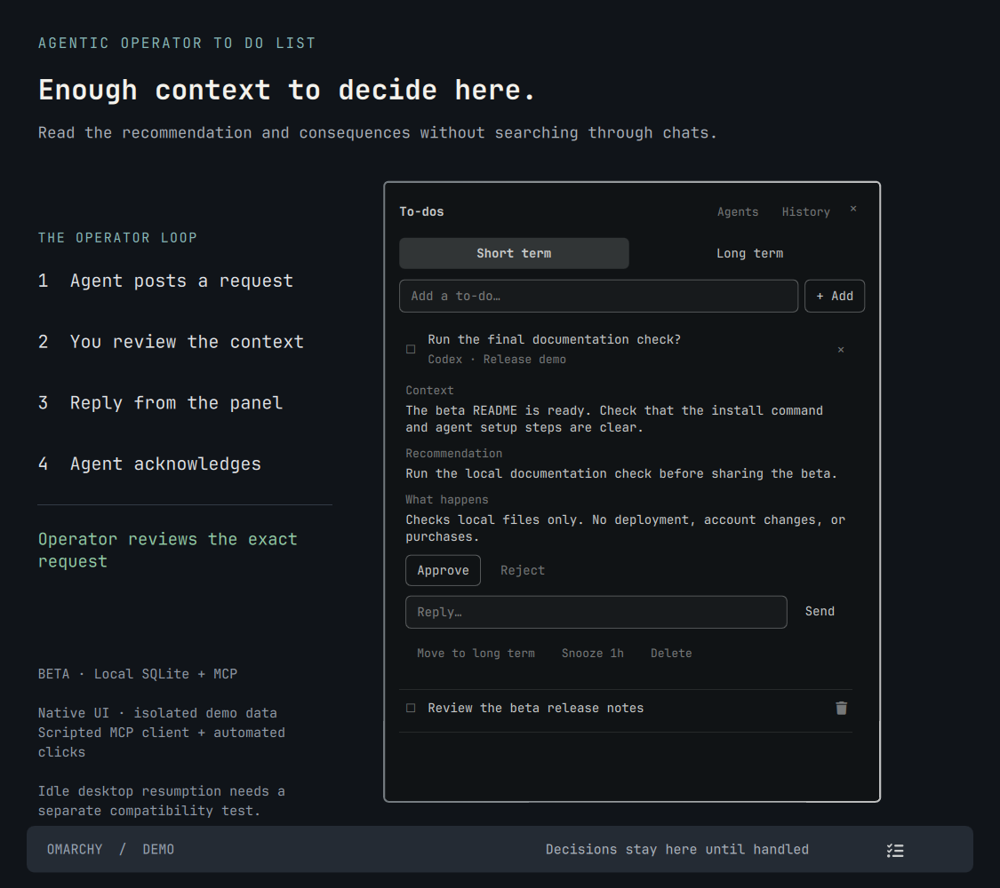
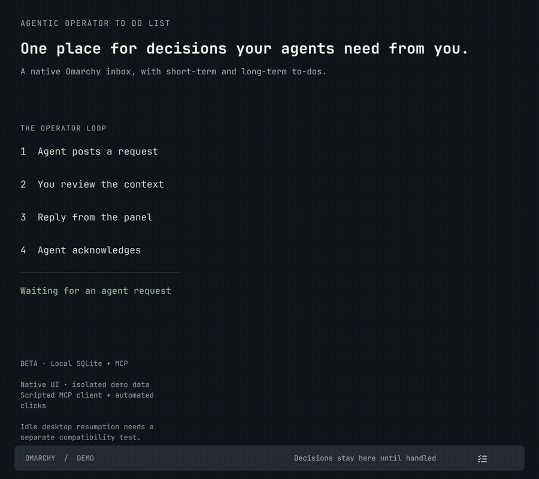

# Agentic Operator To Do List

**Your agents' decision inbox, in the Omarchy bar.**

Keep important decisions from Codex, Claude, and Hermes in one place. Read the
context, recommendation, and consequences, then approve, reject, or reply from
the panel. Short-term and long-term lists also hold the to-dos you explicitly
ask agents to add.

Version 0.2.1 is a beta release. The native list and local MCP flow are tested.
Idle Codex resumption passed a live test on desktop build `26.901.51231`; its
internal desktop interface remains experimental and version-sensitive.



<details>
<summary>Watch the 30-second demo</summary>



[Download the MP4](docs/demo.mp4). This recording uses the real native UI, an
isolated database, a scripted MCP client, and automated button clicks. It verifies
the MCP reply/acknowledgement flow; it does not verify idle Codex resumption.

</details>

Click the checklist icon to open the list. A small red dot in its upper-right
corner appears while the panel is closed when a request or failed reply delivery
needs you. Green connection dots appear only in **Agents**. There are no
notification popups or badge counts; the tabs read **Short term** and **Long term**.
The panel always opens to its full size, fitted to your screen. The header and Add
field stay in place while the list scrolls with the wheel, trackpad, scrollbar,
or Page Up / Page Down.

## Using the list

- **Add:** type a task and press Enter or click **+ Add**. The input is focused on
  opening. Clicking an empty Add focuses it; successful saves clear it, and failed
  saves keep the draft and show an error. Tasks go into the selected term.
- **Short term / Long term:** separate lists, with an inline action to move tasks.
- **Decisions:** expand a row to read context, recommendation, and consequences.
  Approve, Reject, choose an option, or send a written reply from the row.
- **Complete:** click a task's checkbox. A decision must receive a response;
  its checkbox opens the details instead of implicitly approving it.
- **Dismiss:** an agent request's **×** clears it without granting approval.
  The agent can read that dismissal, and repeating the same request won't revive it.
- **Delete:** use the trash icon or the expanded row's Delete action. Content is
  removed; a small identity tombstone prevents an agent from recreating that request.
- **History:** answered-and-acknowledged tasks and dismissed requests remain here
  until deleted. Replies awaiting delivery remain visible in the main list.
- **Move back:** click the return arrow in History, or expand the row and select
  **Move back to list**. It reopens in its original short- or long-term list.
  Agent requests need a fresh response; moving back does not undo work already done.
- **Snooze:** silence an open agent request's dot for one hour.

The first important decision opens its details when you open the list. Nothing
executes merely because an agent creates a request. A reply records the operator's
decision; the originating agent performs authorized work through its own tools.
Native application security/permission prompts retain their normal handling.

## Install

Requires Omarchy's Quickshell plugin system and Python 3.11 or newer. There are no
Python package dependencies for the list, Codex, or Claude; no accounts, cloud
services, or open TCP ports. The optional Hermes adapter also uses PyYAML,
already required by Hermes (Arch package `python-yaml`).

Install directly with Omarchy:

```bash
omarchy plugin add https://github.com/ptanner66-prog/agentic-operator-to-do-list --enable
```

Then open **Agents** in the panel to connect your apps. To work from a source
checkout instead:

```bash
git clone https://github.com/ptanner66-prog/agentic-operator-to-do-list.git
cd agentic-operator-to-do-list
python3 install.py
```

To configure the local Codex and Claude desktop integrations as well:

```bash
python3 install.py --connect codex claude
```

Or open **Agents** in the panel and click **Connect** beside each app. **Repair**
refreshes that app's setup. A green dot and **Connected** mean at least one live
MCP connection from that app. Configuration and previous policy hooks alone do
not turn it green. Presence is renewed every five seconds, expires after fifteen
seconds without renewal, and clears when the server disconnects or exits.
Multiple clients are tracked independently. This is app-level tool connectivity;
it does not mean every conversation has loaded the tools or can be awakened.

After upgrading from 0.2.0, reconnect each app's MCP tools after active work
finishes so its server can report live status. Existing servers keep their old
code until reconnected. **Repair** updates setup; it does not restart the app.

Use `python3 install.py --connect hermes` to connect the local Hermes installation
and its existing profiles. Remote bots remain a separate connection.

The installer copies the plugin to `~/.config/omarchy/plugins/portertanner.operator-todos`,
adds it to the right section of the current bar, and preserves existing app settings.
It validates setup edits before writing, backs up changed files, and rolls back
earlier writes if a later write fails. Unusual Codex TOML layouts that cannot be
safely edited are rejected with the original settings retained. Agent connections
are optional.
Use `--no-enable` to install without changing bar placement.

You can also run the installed `install.py` with `--connect` to configure the
desired agent apps. The permanent plugin ID is `portertanner.operator-todos`.

## Standing agent policy

The plugin manages a shared policy under
`~/.config/omarchy/operator-todos/AGENTS.md`, generated from `agent-policy.md`.
Each **Connect** or **Repair** synchronizes it into the files each agent actually
loads. Omarchy's `shell.json` configures the desktop; it is not an instruction
file read universally by agents.

- **Codex:** its active global `AGENTS.override.md` or `AGENTS.md`, MCP registration,
  and `SessionStart` / `UserPromptSubmit` hooks in `~/.codex/hooks.json`.
- **Claude Code:** a bounded block in `~/.claude/CLAUDE.md`, MCP registration,
  and the same lifecycle hooks in `~/.claude/settings.json`.
- **Claude Chat:** the local MCP server supplies the policy during initialization
  and in its posting-tool description. Claude Code files do not configure regular Chat.
- **Hermes:** MCP registration and a bounded policy block in `SOUL.md` for the
  main local configuration and every existing profile. Reconnect after adding a profile.

Hooks provide policy and request IDs at session start and each user turn. They
do not read transcripts, store prompts, create requests from guesses, or block a
turn. Codex skips new hooks until its native hook review has trusted them; use
`/hooks` in Codex to review them. The global instruction block works independently.
Current app configuration and policy guidance cannot guarantee model compliance
or retroactively change a turn already in progress.

These mechanisms follow [Codex instructions](https://learn.chatgpt.com/docs/agent-configuration/agents-md),
[Codex hooks](https://learn.chatgpt.com/docs/hooks),
[Claude Code memory](https://code.claude.com/docs/en/memory), and
[Claude Code hooks](https://code.claude.com/docs/en/hooks).

## Agent integrations and their limits

**Codex:** installation registers the MCP server in `~/.codex/config.toml` and
adds a bounded instruction block to `~/.codex/AGENTS.md`. For a waiting MCP call,
the reply is returned directly to the active agent. For an idle local desktop
conversation, a built-in experimental adapter attempts to send the reply through the running
desktop app's local IPC socket. It does not start a second Codex instance.

The desktop adapter uses an internal, version-sensitive protocol observed in
desktop build `26.901.51231`. This is not a stable public API. It needs a loaded
conversation owner and may stop working after an app update. An unavailable owner,
timeout, or delivery error leaves the reply visible with a red dot. Uncertain
sends are not automatically retried. Open the original chat to check it before
resending. “Sent” means accepted by the app; “Agent acknowledged” requires an
explicit acknowledgement from the agent. It does not claim that work has resumed
solely because a socket write succeeded.

**Live verification, 2026-09-13:** a real Codex task posted an isolated request
through the CLI fallback and finished its turn. After it became idle, the native
panel's Approve button was activated programmatically. The unchanged dispatcher
resumed that same task through desktop IPC; the agent read and acknowledged the
exact response ID 7.7 seconds after approval. There was no active `operator_wait`
and no follow-up sent through a separate task tool. This verifies one local
task with a discoverable owner on build `26.901.51231`, not every app version or
conversation state. See [the verification record](docs/live-codex-verification.json).

**Claude Desktop:** installation configures a local MCP server in
`~/.config/Claude/claude_desktop_config.json`. It also adds the server to Claude
Code's user configuration and a bounded instruction block to `~/.claude/CLAUDE.md`
for the desktop Code surface. MCP initialization and tool descriptions carry the
operator-list policy for clients that expose those tools.

An active `operator_wait` call receives your answer and lets the conversation
continue. A closed or idle regular Chat conversation cannot be awakened by this
MCP server alone. In that case the response stays saved; open the original chat
and have the agent read it. Cowork's connector availability must be verified in
that installation; this plugin does not claim automatic coverage of every mode.

**Existing conversations:** configuration does not rewrite the instructions or
tool set of a turn already in flight. Reconnect tools or restart each desktop app
after current work finishes if the new tools do not appear. The Codex/Code
instruction blocks include a CLI fallback. No historical chat scanning or
automatic import is performed. The plugin only contains what you or an agent posts.

**Hermes and other agents:** installation can connect local Hermes profiles, or use
the same stdio MCP server with
`python3 /path/to/operator_todos.py mcp --source hermes`, or use the JSON CLI below.
For bots on another machine, configure a transport to this desktop separately.
This release does not expose your list over the network.

## Agent tools

`operator_post` requires a stable `request_key`, title, kind, term, and context.
Agent-created requests must set `important: true` or `explicitly_requested: true`.
Approval/choice items additionally require a recommendation and consequences.
Provide the actual `session_id` and `chat_url` when the client makes them available.
Do not invent conversation identifiers. Codex links can be derived from its UUID.

- `operator_post`: save one request, idempotent for source + session + request key.
- `operator_list`: read requests belonging to this integration, optionally by session.
- `operator_get`: read a specific request and its actual operator response.
- `operator_wait`: wait up to 55 seconds for a response; other calls remain responsive.
- `operator_ack`: acknowledge the exact `response_id` after reading it.

Agents get no approval, deletion, or operator-response MCP tool. A cancelled or
dismissed request never grants authorization. Several chats may write concurrently;
SQLite transactions prevent lost writes. Reposting a request cannot silently change
the action being approved. A materially different decision needs a new request key.

Example CLI request:

```bash
python3 operator_todos.py post - --source hermes <<'JSON'
{
  "request_key": "choose-launch-domain-v1",
  "session_id": "your-real-session-id",
  "title": "Choose the launch domain",
  "kind": "choice",
  "term": "short",
  "important": true,
  "context": "The site is ready. I need the domain before configuring it.",
  "recommendation": "Use the existing domain to avoid another purchase.",
  "consequence": "The existing domain has no added cost; a new one costs $20/year.",
  "options": ["Use existing domain", "Choose a new domain"],
  "project": "Website"
}
JSON
```

The command returns the saved request and its ID. Use `get '{"id":"..."}'` to
read the response and `ack '{"id":"...","response_id":"..."}'` after consuming it.
The `act` command is for the human-facing UI and must never be used by an agent
to manufacture an operator decision.

## Storage and removal

Data lives in `$XDG_DATA_HOME/operator-todos/todos.sqlite3`, defaulting to
`~/.local/share/operator-todos/todos.sqlite3`. `OPERATOR_TODOS_DATA` overrides the
directory for isolated tests. Keep the database and its WAL together for live backups.

Disable the widget with `omarchy plugin disable portertanner.operator-todos`. Removing
the plugin does not delete the database or silently erase your tasks. To disconnect
agents before removing it, run:

```bash
python3 install.py --disconnect codex claude hermes
omarchy plugin remove portertanner.operator-todos
```

Disconnect removes this plugin's MCP entries, lifecycle hooks and marked policy
blocks while retaining other configuration and the saved list. Backups sit beside
changed files. Repeating setup makes no duplicate policy blocks or hooks.
Edit `agent-policy.md` in your checkout and reconnect to distribute policy changes.

## Verification

```bash
python3 -m unittest discover -s tests -v
omarchy plugin validate .
python3 tests/run_native_smoke.py
python3 tests/run_fresh_install.py
```

Tests cover concurrent writes, duplicate requests, context requirements, dismissal,
deletion, short/long-term movement, exact-response acknowledgement, delivery failures,
and an actual stdio MCP round trip. Setup tests cover repeated installation,
global overrides, existing hooks, collisions, profile preservation, disconnect,
unusual TOML layouts, and rollback after failed writes. Presence tests cover actual
MCP connect/disconnect, crashes, stale heartbeats, and independent clients.
The native smoke test temporarily loads the real panel into the existing shell,
uses an isolated database, and exercises Add, Enter, failure recovery, History,
count-free tab labels, and connection/attention indicator behavior.
It never opens a window or sends physical keystrokes. Live desktop testing is still
necessary when updating the Codex IPC adapter. See `PUBLISHING.md` for release checks.

The fresh-install check clones the public repository into a temporary directory,
installs into isolated user/config/data directories, connects empty Codex/Claude
settings and a Hermes fixture when PyYAML is available, checks installed commands
and MCP initialization, and disconnects while retaining the database. It uses an
existing Omarchy host; it is not a fresh operating-system or live desktop-app test.

All 31 Python tests pass on the recorded Omarchy host. The two subprocess-presence
tests require Linux procfs to expose child-process identities. Restricted or
virtualized execution environments may report those differently; investigate
such failures on the supported host rather than interpreting them as a verified
desktop result. The socket-cleanup unit test uses a mock endpoint and does not
require permission to bind a local socket.

## License

Open source under the [MIT license](LICENSE). Contributions and bug reports are
welcome through this repository's pull requests and issues.
